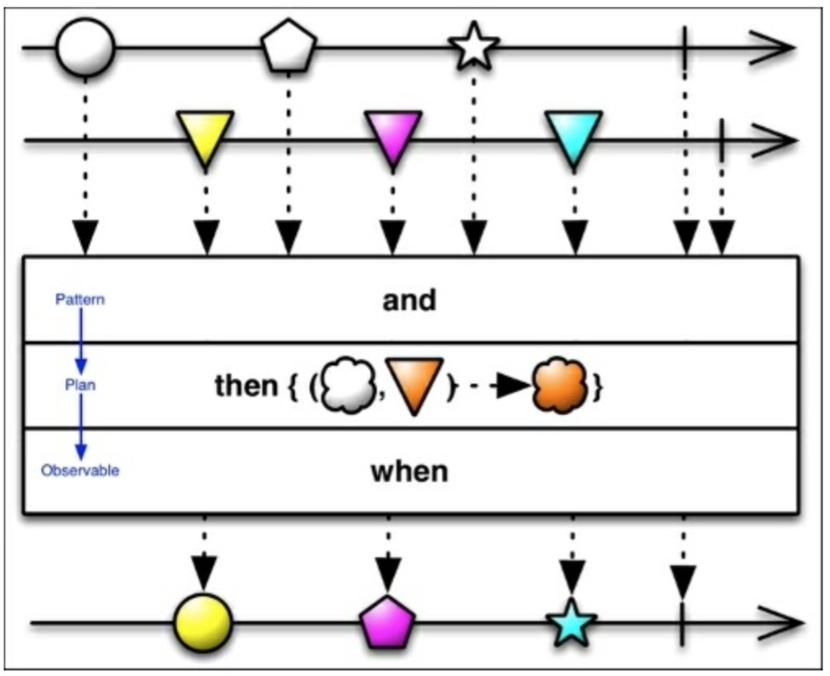

# And,Then和When

在将来还有一些`zip()`满足不了的场景。如复杂的架构，或者是仅仅为了个人爱好，你可以使用And/Then/When解决方案。它们在RxJava的joins包下，使用Pattern和Plan作为中介，将发射的数据集合并到一起。



我们的`loadList()`函数将会被修改从这样：
```java
private void loadList(List<AppInfo> apps) {

    mRecyclerView.setVisibility(View.VISIBLE);

    Observable<AppInfo> observableApp = Observable.from(apps);
    
    Observable<Long> tictoc = Observable.interval(1, TimeUnit.SECONDS);
    
    Pattern2<AppInfo, Long>pattern = JoinObservable.from(observableApp).and(tictoc); 
    
    Plan0<AppInfo> plan = pattern.then(this::updateTitle);
    
    JoinObservable
        .when(plan)
        .toObservable()
        .observeOn(AndroidSchedulers.mainThread())
        .subscribe(new Observer<AppInfo>() {
        
            @Override
            public void onCompleted() {
                Toast.makeText(getActivity(), "Here is the list!", Toast.LENGTH_LONG).show();
            }
            
            @Override
            public void onError(Throwable e) { mSwipeRefreshLayout.setRefreshing(false); Toast.makeText(getActivity(), "Something went wrong!", Toast.LENGTH_SHORT).show();
            }
            @Override
            public void onNext(AppInfoappInfo) {
            if (mSwipeRefreshLayout.isRefreshing()) { mSwipeRefreshLayout.setRefreshing(false);
            } mAddedApps.add(appInfo);
            intposition = mAddedApps.size() - 1; mAdapter.addApplication(position, appInfo); mRecyclerView.smoothScrollToPosition(position);
            } });
}
```