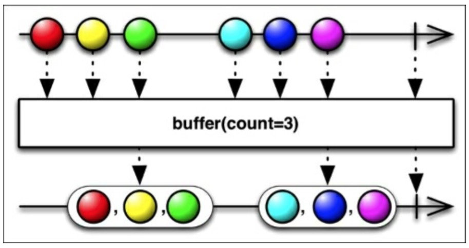

# Buffer

RxJava中的`buffer()`函数将源Observable变换一个新的Observable，这个新的Observable每次发射一组列表值而不是一个一个发射。

上图中展示了`buffer()`如何将`count`作为一个参数来指定有多少数据项被包在发射的列表中。实际上，`buffer()`函数有几种变体。其中有一个时允许你指定一个`skip`值：此后每当收到skip项数据，用count项数据就填充缓存。如下图所示：

`buffer()`定期以List的形式发射新的数据，每个时间段，收集来自原始Observable的数据（从前面一个数据包裹之后，或者如果是第一个数据包裹，从有观察者订阅原来的Observale之后开始）。还有另一个版本的buffer接受一个Scheduler参数，默认情况下会使用computation调度器。+

