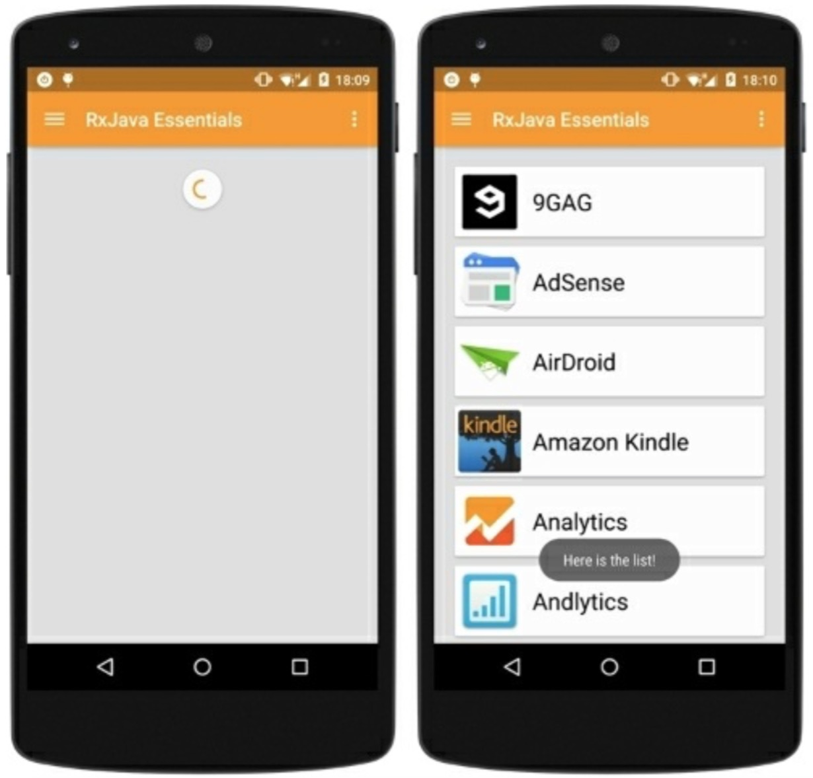

# 我们的第一个Observable

在我们的第一个列子里，我们将检索安装的应用列表并填充RecycleView的item来展示它们。我们也设想一个下拉刷新的功能和一个进度条来告知用户当前任务正在执行。

首先，我们创建Observable。我们需要一个函数来检索安装的应用程序列表并把它提供给我们的观察者。我们一个接一个的发射这些应用程序数据，将它们分组到一个单独的列表中，以此来展示响应式方法的灵活性。

```java
private Observable<AppInfo> getApps(){
    return Observable.create(subscriber -> {
        List<AppInfoRich> apps = new ArrayList<AppInfoRich>();

        final Intent mainIntent = new Intent(Intent.ACTION_MAIN,null);
        mainIntent.addCategory(Intent.CATEGORY_LAUNCHER);

        List<ResolveInfo> infos = getActivity().getPackageManager().queryIntentActivities(mainIntent, 0);

        for(ResolveInfo info : infos){
            apps.add(new AppInfoRich(getActivity(),info));
        }

        for (AppInfoRich appInfo:apps) {
            Bitmap icon = Utils.drawableToBitmap(appInfo.getIcon());
            String name = appInfo.getName();
            String iconPath = mFilesDir + "/" + name;
            Utils.storeBitmap(App.instance, icon,name);
            
            if (subscriber.isUnsubscribed()){
                return;
            }
            subscriber.onNext(new AppInfo(name,iconPath,appInfo.getLastUpdateTime()));                
        }
        if (!subscriber.isUnsubscribed()){
            subscriber.onCompleted();
        }
    });
}
```
AppInfo对象如下：
```java
@Data
@Accessors(prefix = "m")
public class AppInfo implements Comparable<Object> {

    long mLastUpdateTime;
    String mName;
    String mIcon;

    public AppInfo(String nName, long lastUpdateTime, String icon) {
        mName = nName;
        mIcon = icon;
        mLastUpdateTime = lastUpdateTime;
    }

    @Override
    public int compareTo(Object another) {
        AppInfo f = (AppInfo)another;
        return getName().compareTo(f.getName());
    }
}
```
需要重点注意的是在发射新的数据或者完成序列之前要检测观察者的订阅情况。这样的话代码会更高效，因为如果没有观察者等待时我们就不生成没有必要的数据项。

此时，我们可以订阅Observable并观察它。订阅一个Observable意味着当我们需要的数据进来时我们必须提供对应的操作来执行它。

当前的场景是什么？我们展示一个进度条来等待数据。当数据到来时，我们需要隐藏掉进度条,填充list,最终展示列表。现在，我们知道当一切都准备好了该做什么。那么错误的场景呢？对于错误这种情况，我们仅仅是用Toast展示一个错误的信息。

使用Butter Knife,我们得到list和下拉刷新组件的引用：
```java
@InjetcView(R.id.fragment_first_example_list)
RecyclerView mRecycleView;
    
@InjectView(R.id.fragment_first_example_swipe_container)
SwipeRefreshLayout mSwipeRefreshLayout;
```

我们使用Android 5的标准组件：RecyclerView和SwipeRefreshLayout。截屏展示了我们这个简单App的list Fragment的layout文件：


我们使用一个下拉刷新方法，因此列表数据可以来自初始化加载，或由用户触发的一个刷新动作。针对这两个场景，我们用同样的行为，因此我们把我们的观察者放在一个易被复用的函数里面。下面是我们的观察者，定义了成功、失败、完成要做的事情：

```java
private void refreshTheList() {
    getApps().toSortedList()
            .subscribe(new Observer<List<AppInfo>>() {

                @Override
                public void onCompleted() {
                    Toast.makeText(getActivity(), "Here is the list!", Toast.LENGTH_LONG).show();
                }

                @Override
                public void onError(Throwable e) {
                    Toast.makeText(getActivity(), "Something went wrong!", Toast.LENGTH_SHORT).show();
                    mSwipeRefreshLayout.setRefreshing(false);
                }

                @Override
                public void onNext(List<AppInfo> appInfos) {
                    mRecyclerView.setVisibility(View.VISIBLE);
                    mAdapter.addApplications(appInfos);
                    mSwipeRefreshLayout.setRefreshing(false);
                }
            });
}
```

定义一个函数使我们能够用同样一个block来处理两种场景成为了可能。当fragment加载时我们只需调用`refreshTheList()`方法并设置`refreshTheList()`方法作为用户下拉这一行为所触发的方法。

```java
mSwipeRefreshLayout.setOnRefreshListener(this::refreshTheList);
```

我们第一个例子现在完成了，运行跑一下。




