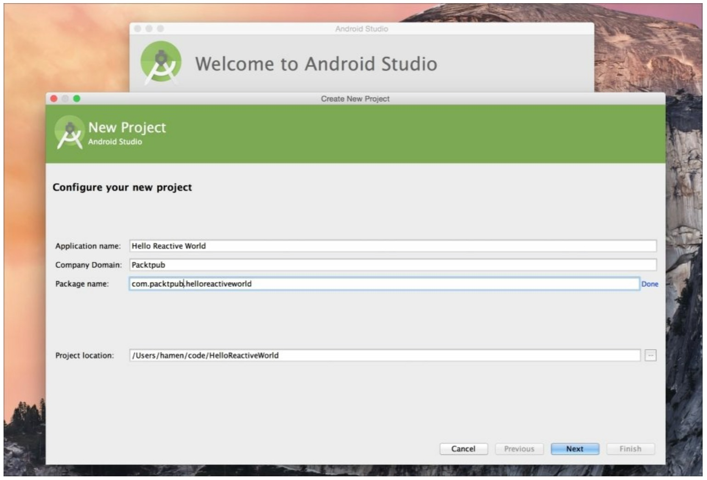
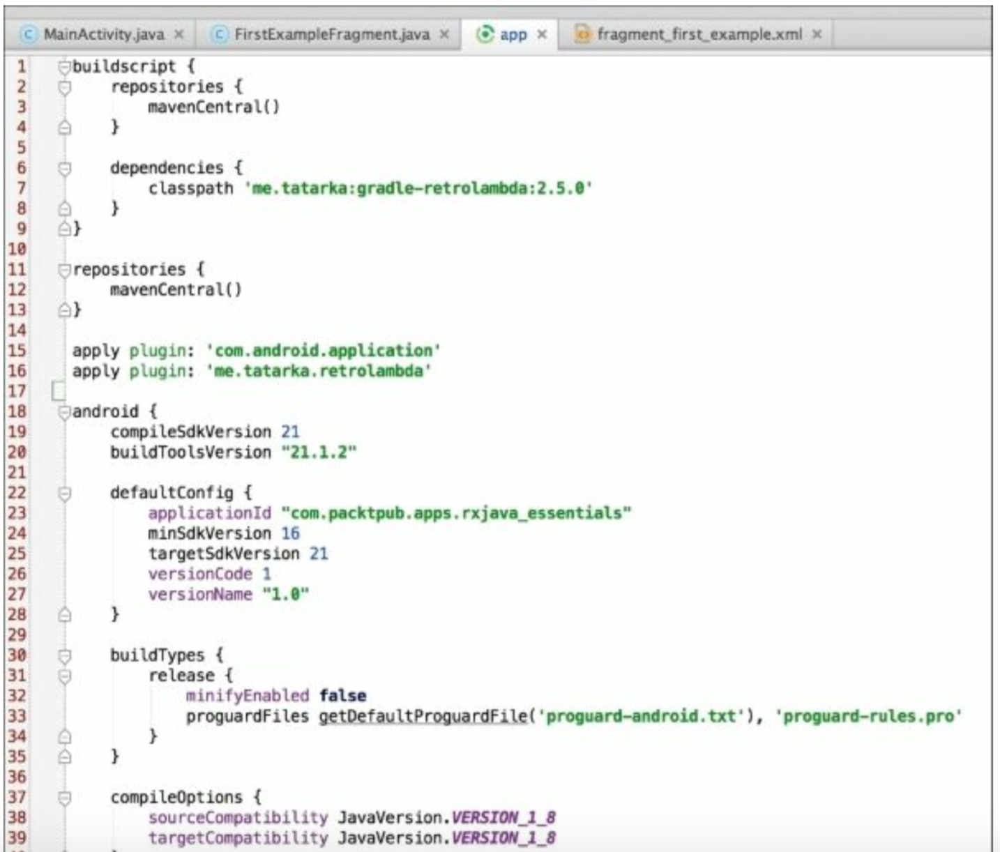

# 启动引擎

我们将使用IntelliJ IDEA/Android Studio来创建这个工程，因此你会对截图看起来比较熟悉。

让我们开始创建一个新的Android工程。你可以创建你自己的工程或者用本书中提供的导入。选择你自己喜欢的创建方式这取决于你。

如果你想用Android Studio创建一个新的工程，通常你可以参考官方文档：http://developer.android.com/intl/zh-cn/training/basics/firstapp/creating-project.html

### 依赖

很明显，我们将使用**Gradle**来管理我们的依赖列表。我们的build.gradble文件看起来像这样：
 
 
正如你看到的我们引入了RxAndroid。RxAndroid是RxJava的增强版，尤其是针对Android设计的。
### RxAndroid

RxAndroid是RxJava家族的一部分。它基于RxJava1.0.x,在普通的RxJava基础上添加了几个有用的类。大多数情况下，它为Android添加了特殊的调度器。我们将在第七章Schedulers-Defeating the Android MainThread Issue再讨论它。

