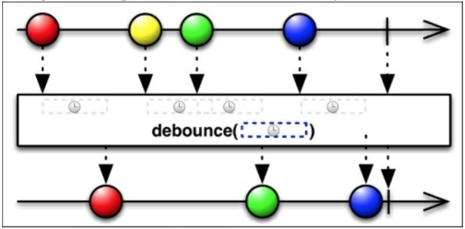

# Debounce

`debounce()`函数过滤掉由Observable发射的速率过快的数据；如果在一个指定的时间间隔过去了仍旧没有发射一个，那么它将发射最后的那个。

就像`sample()`和`timeout()`函数一样，`debounce()`使用`TimeUnit`对象指定时间间隔。

下图展示了多久从Observable发射一次新的数据，`debounce()`函数开启一个内部定时器，如果在这个时间间隔内没有新的数据发射，则新的Observable发射出最后一个数据：

