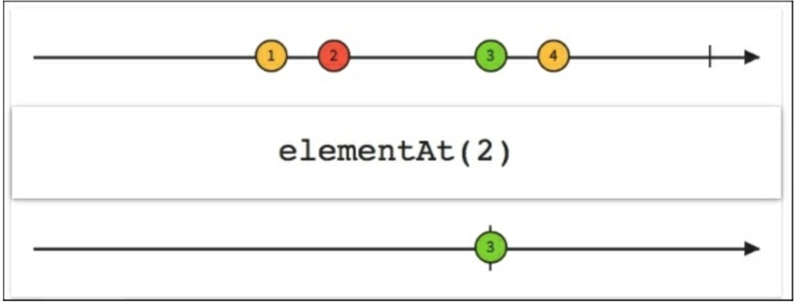

# ElementAt

如果我们只想要可观测序列发射的第五个元素该怎么办？`elementAt()`函数仅从一个序列中发射第n个元素然后就完成了。

如果我们想查找第五个元素但是可观测序列只有三个元素可供发射时该怎么办？我们可以使用`elementAtOrDefault()`。下图展示了如何通过使用`elementAt(2)`从一个序列中选择第三个元素以及如何创建一个只发射指定元素的新的Observable。

