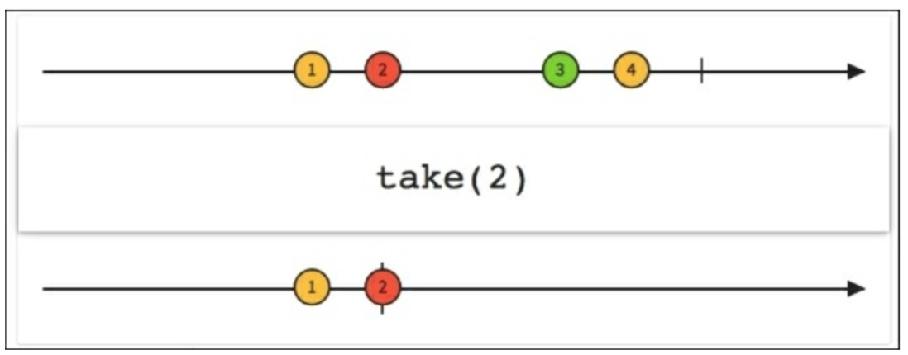

# 获取我们需要的数据

当我们不需要整个序列时，而是只想取开头或结尾的几个元素，我们可以用`take()`或`takeLast()`。

## Take

如果我们只想要一个可观测序列中的前三个元素那将会怎么样，发射它们，然后让Observable完成吗？`take()`函数用整数N来作为一个参数，从原始的序列中发射前N个元素，然后完成：
```java
private void loadList(List<AppInfo> apps) {
    mRecyclerView.setVisibility(View.VISIBLE);
    Observable.from(apps)
            .take(3)
            .subscribe(new Observer<AppInfo>() {

                @Override
                public void onCompleted() {
                    mSwipeRefreshLayout.setRefreshing(false);
                }

                @Override
                public void onError(Throwable e) {
                    Toast.makeText(getActivity(), "Something went wrong!", Toast.LENGTH_SHORT).show();
                    mSwipeRefreshLayout.setRefreshing(false);
                }

                @Override
                public void onNext(AppInfo appInfo) {
                    mAddedApps.add(appInfo); 
                    mAdapter.addApplication(mAddedApps.size() - 1,appInfo);
                }
            });
}
```
下图中展示了发射数字的一个可观测序列。我们对这个可观测序列应用`take(2)`函数，然后我们创建一个只发射可观测源的第一个和第二个数据的新序列。



## TakeLast

如果我们想要最后N个元素，我们只需使用`takeLast()`函数：
```java
Observable.from(apps)
        .takeLast(3)
        .subscribe(...);
```
正如听起来那样不值一提，重点注意`takeLast()`函数由于用一组有限的发射数的本质使得它仅可用于完成的序列。

下图中展示了如何从可观测源中发射最后一个元素来创建一个新的序列：


下图中展示了我们在已安装的应用列表使用`take()`和`takeLast()`函数后发生的结果：


