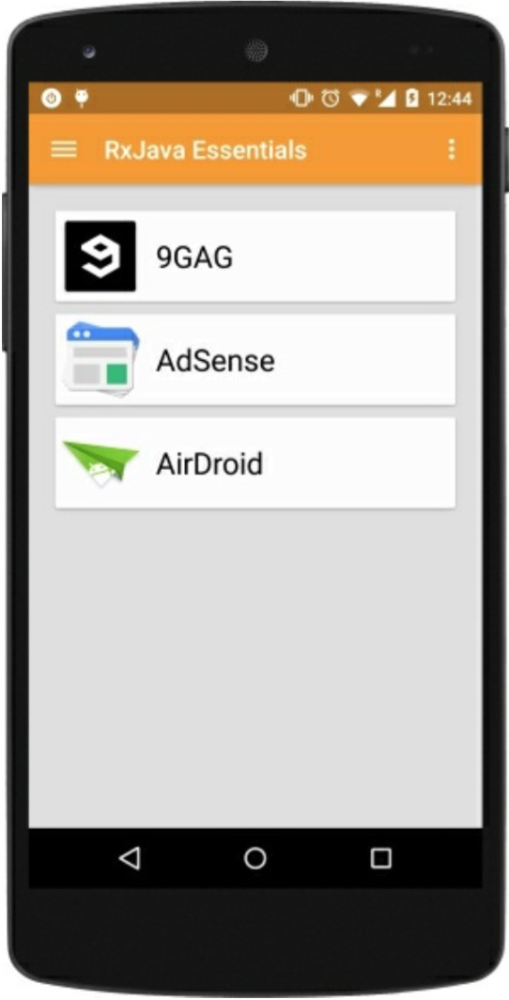
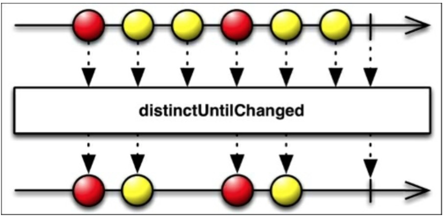

# 有且仅有一次

一个可观测序列会在出错时重复发射或者被设计成重复发射。`distinct()`和`distinctUntilChanged()`函数可以方便的让我们处理这种重复问题。

## Distinct

如果我们想对一个指定的值仅处理一次该怎么办？我们可以对我们的序列使用`distinct()`函数去掉重复的。就像`takeLast()`一样，`distinct()`作用于一个完整的序列，然后得到重复的过滤项，它需要记录每一个发射的值。如果你在处理一大堆序列或者大的数据记得关注内存使用情况。

下图展示了如何在一个发射1和2两次的可观测源上创建一个无重的序列：


为了创建我们例子中序列，我们将使用我们至今已经学到的几个方法：
* `take()`：它有一小组的可识别的数据项。
* `repeat()`：创建一个有重复的大的序列。

然后，我们将应用`distinct()`函数来去除重复。

## 注意

我们用程序实现一个重复的序列，然后过滤出它们。这听起来时不可思议的，但是为了实现这个例子来使用我们至今为止已学习到的东西则是个不错的练习。

```java
Observable<AppInfo> fullOfDuplicates = Observable.from(apps)
    .take(3)
    .repeat(3);
```
`fullOfDuplicates`变量里把我们已安装应用的前三个重复了3次：有9个并且许多重复的。然后，我们使用`distinct()`:
```java
fullOfDuplicates.distinct()
            .subscribe(new Observer<AppInfo>() {

                @Override
                public void onCompleted() {
                    mSwipeRefreshLayout.setRefreshing(false);
                }

                @Override
                public void onError(Throwable e) {
                    Toast.makeText(getActivity(), "Something went wrong!", Toast.LENGTH_SHORT).show();
                    mSwipeRefreshLayout.setRefreshing(false);
                }

                @Override
                public void onNext(AppInfo appInfo) {
                    mAddedApps.add(appInfo); 
                    mAdapter.addApplication(mAddedApps.size() - 1,appInfo);
                }
            });
}
```
结果，很明显，我们得到：



## DistinctUntilsChanged

如果在一个可观测序列发射一个不同于之前的一个新值时让我们得到通知这时候该怎么做？我们猜想一下我们观测的温度传感器，每秒发射的室内温度：
```
21°...21°...21°...21°...22°...
```
每次我们获得一个新值，我们都会更新当前正在显示的温度。我们出于系统资源保护并不想在每次值一样时更新数据。我们想忽略掉重复的值并且在温度确实改变时才想得到通知。`ditinctUntilChanged()`过滤函数能做到这一点。它能轻易的忽略掉所有的重复并且只发射出新的值。

下图用图形化的方式展示了我们如何将`distinctUntilChanged()`函数应用在一个存在的序列上来创建一个新的不重复发射元素的序列。




