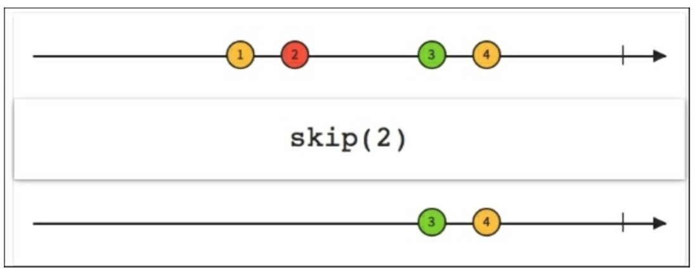
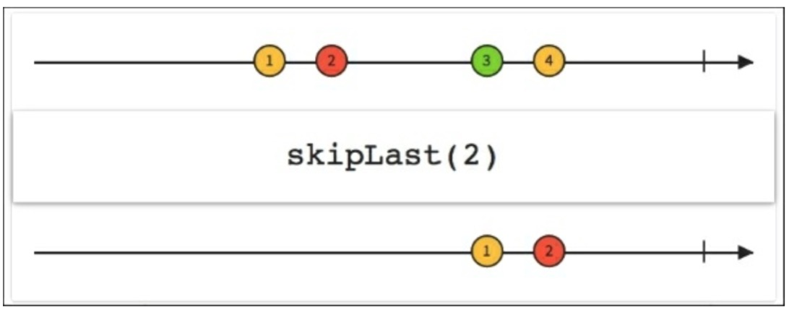

# Skip and SkipLast

下图中展示了如何使用`skip(2)`来创建一个不发射前两个元素而是发射它后面的那些数据的序列。

`skip()`和`skipLast()`函数与`take()`和`takeLast()`相对应。它们用整数N作参数，从本质上来说，它们不让Observable发射前N个或者后N个值。如果我们知道一个序列以没有太多用的“可控”元素开头或结尾时我们可以使用它。

下图与前一个场景相对应：我们创建一个新的序列，它会跳过后面两个元素从源序列中发射剩下的其他元素。

