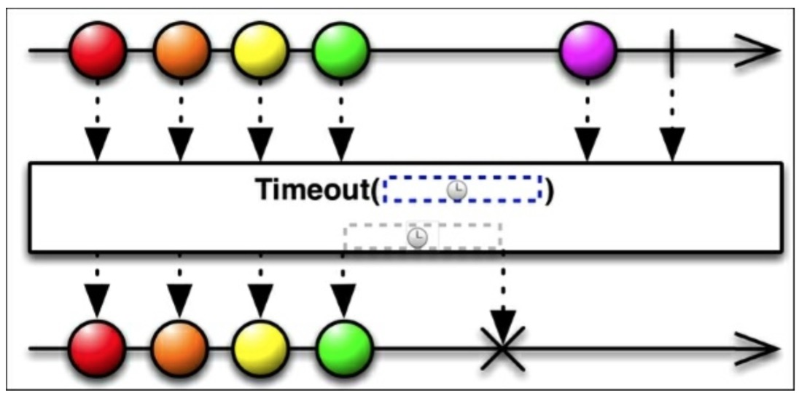

# Timeout

假设我们工作的是一个时效性的环境，我们温度传感器每秒都在发射一个温度值。我们想让它每隔两秒至少发射一个，我们可以使用`timeout()`函数来监听源可观测序列,就是在我们设定的时间间隔内如果没有得到一个值则发射一个错误。我们可以认为`timeout()`为一个Observable的限时的副本。如果在指定的时间间隔内Observable不发射值的话，它监听的原始的Observable时就会触发`onError()`函数。

```java
Subscription subscription = getCurrentTemperature()
    .timeout(2,TimeUnit.SECONDS)
    .subscribe(new Observer<Integer>() {

        @Override
        public void onCompleted() {
           
        }

        @Override
        public void onError(Throwable e) {
            Log.d("RXJAVA","You should go check the sensor, dude");
        }

        @Override
        public void onNext(Integer currentTemperature) {
            updateDisplay(currentTemperature)
        }
    });
```

和`sample()`一样，`timeout()`使用`TimeUnit`对象来指定时间间隔。

下图中展示了一旦Observable超过了限时就会触发`onError()`函数：因为超时后它才到达，所以最后一个元素将不会发射出去。




