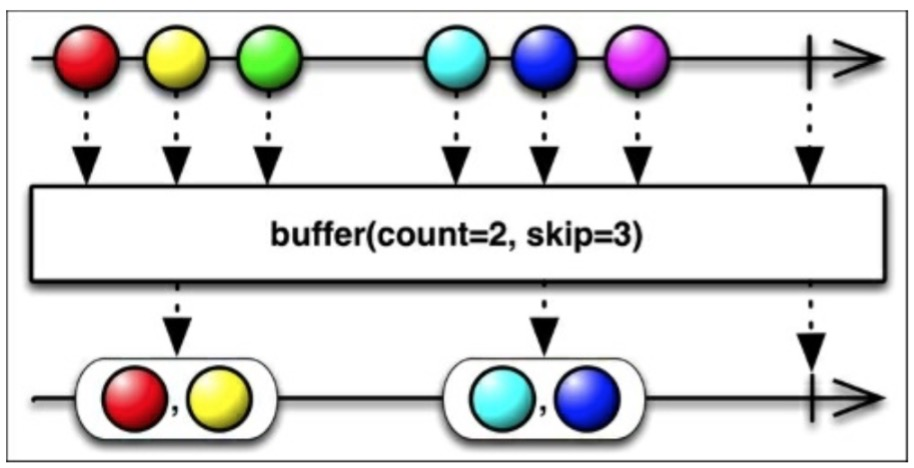
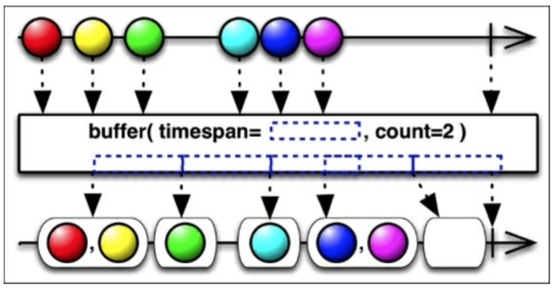

# Buffer

RxJava中的`buffer()`函数将源Observable变换一个新的Observable，这个新的Observable每次发射一组列表值而不是一个一个发射。

上图中展示了`buffer()`如何将`count`作为一个参数来指定有多少数据项被包在发射的列表中。实际上，`buffer()`函数有几种变体。其中有一个是允许你指定一个`skip`值：此后每`skip`项数据，然后又用count项数据填充缓冲区。如下图所示：

`buffer()`带一个`timespan`的参数，会创建一个每隔timespan时间段就会发射一个列表的Observable。

