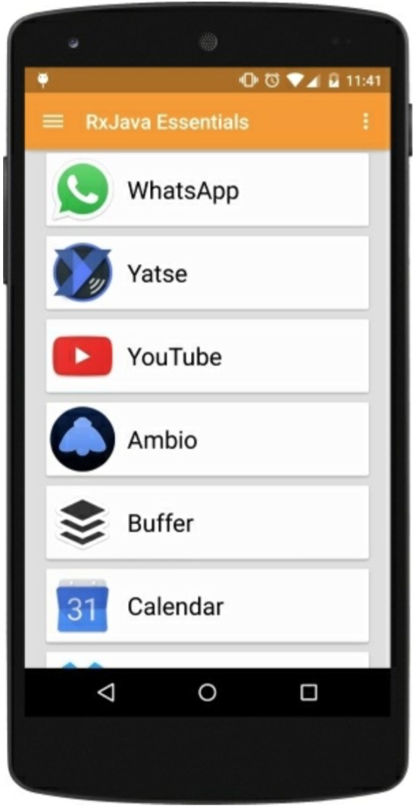

# GroupBy

拿第一个例子开始，我们安装的应用程序列表按照字母表的顺序排序。然而，如果现在我们想按照最近更新日期来排序我们的App时该怎么办？RxJava提供了一个有用的函数从列表中按照指定的规则：`groupBy()`来分组元素。下图中的例子展示了`groupBy()`如何将发射的值根据他们的形状来进行分组。


这个函数将源Observable变换成一个发射Observables的新的Observable。它们中的每一个新的Observable都发射一组指定的数据。

为了创建一个分组了的已安装应用列表，我们在`loadList()`函数中引入了一个新的元素：
```java
Observable<GroupedObservable<String,AppInfo>> groupedItems = Observable.from(apps)
    .groupBy(new Func1<AppInfo,String>(){
        @Override
        public String call(AppInfo appInfo){
            SimpleDateFormat formatter = new SimpleDateFormat("MM/yyyy");
            return formatter.format(new Date(appInfo.getLastUpdateTime()));
        }
    });
```
现在我们创建了一个新的Observable，`groupedItems`，它将会发射一个带有`GroupedObservable`的序列。`GroupedObservable`是一个特殊的Observable，它源自一个分组的key。在这个例子中，key就是`String`，代表的意思是`Month/Year`格式化的最近更新日期。

这一点，我们已经创建了几个发射`AppInfo`数据的Observable，用来填充我们的列表。我们想保留字母排序和分组排序。我们将创建一个新的Observable将所有的联系起来，像往常一样然后订阅它：

```java
Observable.concat(groupedItems)
    .subscribe(new Observer<AppInfo>() {

        @Override
        public void onCompleted() {
            mSwipeRefreshLayout.setRefreshing(false);
        }

        @Override
        public void onError(Throwable e) {
            Toast.makeText(getActivity(), "Something went wrong!", Toast.LENGTH_SHORT).show();
            mSwipeRefreshLayout.setRefreshing(false);
        }

        @Override
        public void onNext(AppInfo appInfo) {
            mAddedApps.add(appInfo); 
            mAdapter.addApplication(mAddedApps.size() - 1,appInfo);
        }
    });
```

我们的`loadList()`函数完成了，结果是：




