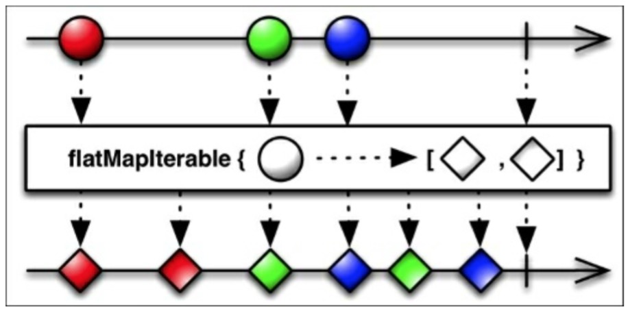
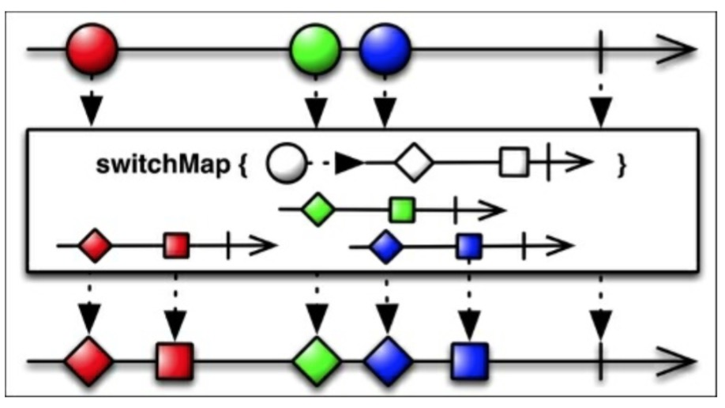
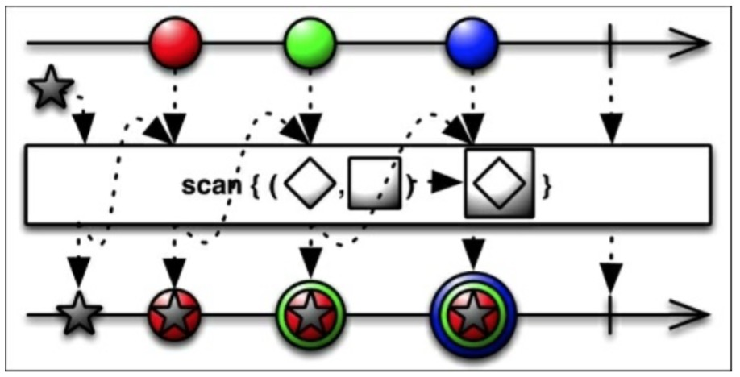

# *map家族

RxJava提供了几个mapping函数：`map()`,`flatMap()`,`concatMap()`,`flatMapIterable()`以及`switchMap()`.所有这些函数都作用于一个可观测序列，然后变换它发射的值，最后用一种新的形式返回它们。让我们用合适的“真实世界”的例子一个个的学习下。

## Map

RxJava的`map`函数接收一个指定的`Func`对象然后将它应用到每一个由Observable发射的值上。下图展示了如何将一个乘法函数应用到每个发出的值上以此创建一个新的Observable来发射转换的数据。


考虑下我们已安装的应用列表。我们怎么才能够显示同样的列表，但是又要所有的名字都小写呢？

我们的`loadList()`函数可以改成这样：
```java
private void loadList(List<AppInfo> apps) {
    mRecyclerView.setVisibility(View.VISIBLE);
    Observable.from(apps)
        .map(new Func1<AppInfo,AppInfo>(){
            @Override
            public Appinfo call(AppInfo appInfo){
                String currentName = appInfo.getName();
                String lowerCaseName = currentName.toLowerCase();
                appInfo.setName(lowerCaseName);
                return appInfo;
            }
        })
        .subscribe(new Observer<AppInfo>() {

            @Override
            public void onCompleted() {
                mSwipeRefreshLayout.setRefreshing(false);
            }

            @Override
            public void onError(Throwable e) {
                Toast.makeText(getActivity(), "Something went wrong!", Toast.LENGTH_SHORT).show();
                mSwipeRefreshLayout.setRefreshing(false);
            }

            @Override
            public void onNext(AppInfo appInfo) {
                mAddedApps.add(appInfo); 
                mAdapter.addApplication(mAddedApps.size() - 1,appInfo);
            }
        });
}
```

正如你看到的，像往常一样创建我们发射的Observable之后，我们追加一个`map`调用，我们创建一个简单的函数来更新`AppInfo`对象并提供一个名字小写的新版本给观察者。

## FlatMap

在复杂的场景中，我们有一个这样的Observable：它发射一个数据序列，这些数据本身也可以发射Observable。RxJava的`flatMap()`函数提供一种铺平序列的方式，然后合并这些Observables发射的数据，最后将合并后的结果作为最终的Observable。


当我们在处理可能有大量的Observables时，重要是记住任何一个Observables发生错误的情况，`flatMap()`将会触发它自己的`onError()`函数并放弃整个链。

重要的一点提示是关于合并部分：它允许交叉。正如上图所示，这意味着`flatMap()`不能够保证在最终生成的Observable中源Observables确切的发射顺序。

## ConcatMap

RxJava的`concatMap()`函数解决了`flatMap()`的交叉问题，提供了一种能够把发射的值连续在一起的铺平函数，而不是合并它们，如下图所示：


## FlatMapIterable

作为*map家族的一员，`flatMapInterable()`和`flatMap()`很像。仅有的本质不同是它将源数据两两结成对并生成Iterable，而不是原始数据项和生成的Observables。



## SwitchMap

如下图所示，`switchMap()`和`flatMap()`很像，除了一点：每当源Observable发射一个新的数据项（Observable）时，它将取消订阅并停止监视之前那个数据项产生的Observable，并开始监视当前发射的这一个。



## Scan

RxJava的`scan()`函数可以看做是一个累积函数。`scan()`函数对原始Observable发射的每一项数据都应用一个函数，计算出函数的结果值，并将该值填充回可观测序列，等待和下一次发射的数据一起使用。

作为一个通用的例子，给出一个累加器：
```java
Observable.just(1,2,3,4,5)
        .scan((sum,item) -> sum + item)
        .subscribe(new Subscriber<Integer>() {
            @Override
            public void onCompleted() {
                Log.d("RXJAVA", "Sequence completed.");
            }

            @Override
            public void onError(Throwable e) {
                Log.e("RXJAVA", "Something went south!");
            }

            @Override
            public void onNext(Integer item) {
                Log.d("RXJAVA", "item is: " + item);
            }
        });
```
我们得到的结果是：
```java
RXJAVA: item is: 1
RXJAVA: item is: 3
RXJAVA: item is: 6
RXJAVA: item is: 10
RXJAVA: item is: 15
RXJAVA: Sequence completed.
```
我们也可以创建一个新版本的`loadList()`函数用来比较每个安装应用的名字从而创建一个名字长度递增的列表。

```java
private void loadList(List<AppInfo> apps) {
    mRecyclerView.setVisibility(View.VISIBLE);
    Observable.from(apps)
            .scan((appInfo,appInfo2) -> {
                if(appInfo.getName().length > appInfo2.getName().length()){
                    return appInfo;
                } else {
                    return appInfo2;
                }
            })
            .distinct()
            .subscribe(new Observer<AppInfo>() {

                @Override
                public void onCompleted() {
                    mSwipeRefreshLayout.setRefreshing(false);
                }

                @Override
                public void onError(Throwable e) {
                    Toast.makeText(getActivity(), "Something went wrong!", Toast.LENGTH_SHORT).show();
                    mSwipeRefreshLayout.setRefreshing(false);
                }

                @Override
                public void onNext(AppInfo appInfo) {
                    mAddedApps.add(appInfo); 
                    mAdapter.addApplication(mAddedApps.size() - 1,appInfo);
                }
            });
}
```

结果如下：


有一个`scan()`函数的变体，它用初始值作为第一个发射的值，方法签名看起来像：`scan(R,Func2)`，如下图中的例子这样：




