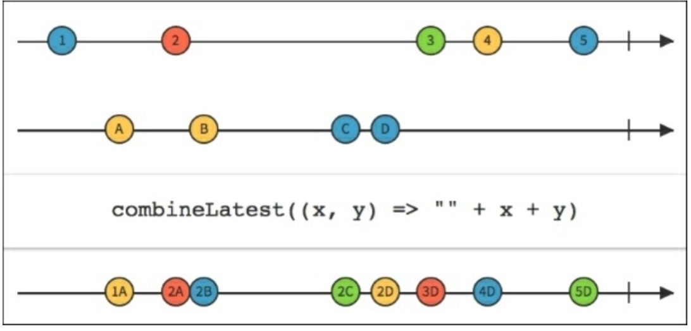
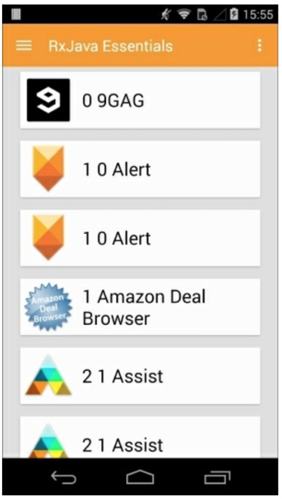

# combineLatest

RxJava的`combineLatest()`函数有点像`zip()`函数的特殊形式。正如我们已经学习的，`zip()`作用于最近未打包的两个Observables。相反，`combineLatest()`作用于最近发射的数据项：如果`Observable1`发射了A并且`Observable2`发射了B和C，`combineLatest()`将会分组处理AB和AC，如下图所示：



`combineLatest()`函数接受二到九个Observable作为参数，如果有需要的话或者单个Observables列表作为参数。

从之前的例子中把`loadList()`函数借用过来，我们可以修改一下来用于`combineLatest()`实现“真实世界”这个例子：
```java
private void loadList(List<AppInfo> apps) {
    mRecyclerView.setVisibility(View.VISIBLE);
    Observable<AppInfo> appsSequence = Observable.interval(1000, TimeUnit.MILLISECONDS)
              .map(position ->apps.get(position.intValue()));
    Observable<Long> tictoc = Observable.interval(1500, TimeUnit.MILLISECONDS);
    Observable.combineLatest(appsSequence, tictoc,
               this::updateTitle)
       .observeOn(AndroidSchedulers.mainThread())
        .subscribe(new Observer<AppInfo>() {
        
        @Override
        public void onCompleted() {
            Toast.makeText(getActivity(), "Here is the list!", Toast.LENGTH_LONG).show();
        }
        
        @Override
        public void onError(Throwable e) {
            mSwipeRefreshLayout.setRefreshing(false);
            Toast.makeText(getActivity(), "Something went wrong!", Toast.LENGTH_SHORT).show();
        }
        
        @Override
        public void onNext(AppInfoappInfo) {
            if (mSwipeRefreshLayout.isRefreshing()) {
                mSwipeRefreshLayout.setRefreshing(false);
            } 
            mAddedApps.add(appInfo);
            int position = mAddedApps.size() - 1;
            mAdapter.addApplication(position, appInfo);
            mRecyclerView.smoothScrollToPosition(position);
        } 
    });
}
```
这我们使用了两个Observables：一个是每秒钟从我们已安装的应用列表发射一个App数据，第二个是每隔1.5秒发射一个`Long`型整数。我们将他们结合起来并执行`updateTitle()`函数，结果如下：



正如你看到的，由于不同的时间间隔，`AppInfo`对象如我们所预料的那样有时候会重复。


