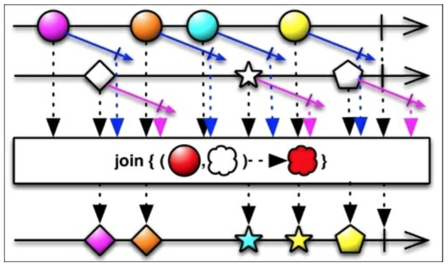
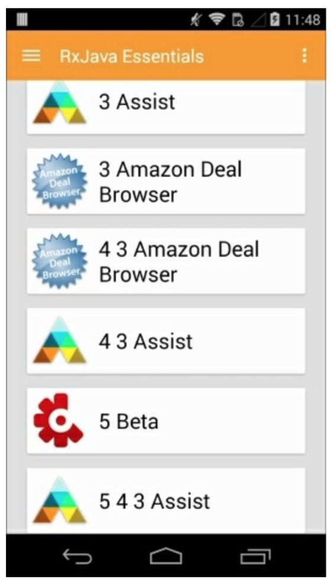
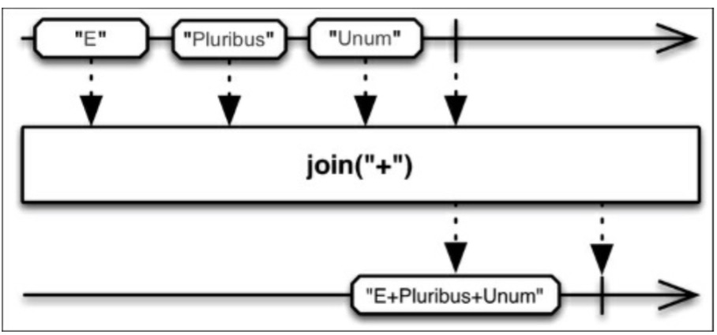

# Join

前面两个方法，`zip()`和`merge()`方法作用在发射数据的范畴内，在决定如何操作值之前有些场景我们需要考虑时间的。RxJava的`join()`函数基于时间窗口将两个Observables发射的数据结合在一起。



为了正确的理解上一张图，我们解释下`join()`需要的参数：

* 第二个Observable和源Observable结合。
* `Func1`参数：在指定的由时间窗口定义时间间隔内，源Observable发射的数据和从第二个Observable发射的数据相互配合返回的Observable。
* `Func1`参数：在指定的由时间窗口定义时间间隔内，第二个Observable发射的数据和从源Observable发射的数据相互配合返回的Observable。
* `Func2`参数：定义已发射的数据如何与新发射的数据项相结合。
* 
如下练习的例子，我们可以修改`loadList()`函数像下面这样：
```java
private void loadList(List<AppInfo> apps) {
    mRecyclerView.setVisibility(View.VISIBLE);
    
    Observable<AppInfo> appsSequence =
    Observable.interval(1000, TimeUnit.MILLISECONDS)
                .map(position -> {
                    return apps.get(position.intValue());
                });
                
    Observable<Long> tictoc = Observable.interval(1000,TimeUnit.MILLISECONDS);
    
    appsSequence.join(
        tictoc, 
        appInfo -> Observable.timer(2,TimeUnit.SECONDS),
        time -> Observable.timer(0, TimeUnit.SECONDS),
        this::updateTitle)
        .observeOn(AndroidSchedulers.mainThread())
        .take(10)
        .subscribe(new Observer<AppInfo>() {
            @Override
            public void onCompleted() {
                Toast.makeText(getActivity(), "Here is the list!", Toast.LENGTH_LONG).show();
            }
            
            @Override
            public void onError(Throwable e) {
                mSwipeRefreshLayout.setRefreshing(false); 
                Toast.makeText(getActivity(), "Something went wrong!", Toast.LENGTH_SHORT).show();
            }
            
            @Override
            public void onNext(AppInfoappInfo) {
                if (mSwipeRefreshLayout.isRefreshing()) {
                    mSwipeRefreshLayout.setRefreshing(false);
                } 
                mAddedApps.add(appInfo);
                int position = mAddedApps.size() - 1;
                mAdapter.addApplication(position, appInfo);
                mRecyclerView.smoothScrollToPosition(position);
            } 
        });
}
```

我们有一个新的对象`appsSequence`，它是一个每秒从我们已安装的app列表发射app数据的可观测序列。`tictoc`这个Observable数据每秒只发射一个新的`Long`型整数。为了合并它们，我们需要指定两个`Func1`变量：

```java
appInfo -> Observable.timer(2, TimeUnit.SECONDS)

time -> Observable.timer(0, TimeUnit.SECONDS)
```
上面描述了两个时间窗口。下面一行描述我们如何使用`Func2`将两个发射的数据结合在一起。
```java
this::updateTitle
```

结果如下：



它看起来有点乱，但是注意app的名字和我们指定的时间窗口，我们可以看到：一旦第二个数据发射了我们就会将它与源数据结合，但我们用同一个源数据有2秒钟。这就是为什么标题重复数字增加的原因。

值得一提的是，为了简单起见，也有一个`join()`操作符作用于字符串然后简单的和发射的字符串连接成最终的字符串。




