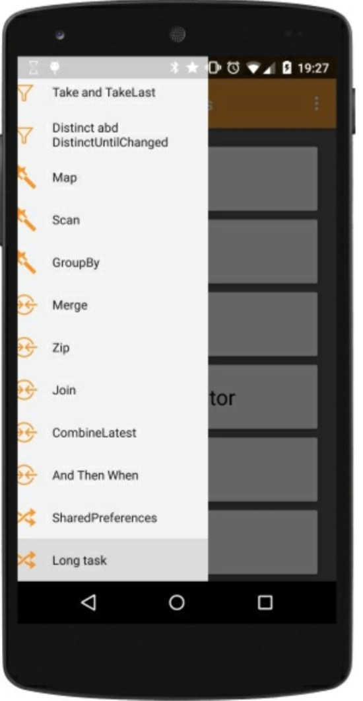

# 处理耗时的任务

我们已经知道如何处理缓慢的I/O操作。让我们看一个与I/O无关的耗时的任务。例如，我们修改`loadList()`函数并创建一个新的`slow`函数发射我们已安装的app数据。

```java
private Observable<AppInfo> getObservableApps(List<AppInfo> apps) {
    return Observable .create(subscriber -> {
        for (double i = 0; i < 1000000000; i++) {
            double y = i * i;
        }
        for (AppInfo app : apps) {
            subscriber.onNext(app);
        }
        subscriber.onCompleted(); 
    });
}
```

正如你看到的，这个函数执行了一些毫无意义的计算，只是针对这个例子消耗时间，然后从`List<AppInfo>`对象中发射我们的`AppInfo`数据，现在，我们重排`loadList()`函数如下：

```java
private void loadList(List<AppInfo> apps) {
    mRecyclerView.setVisibility(View.VISIBLE);
    getObservableApps(apps)
        .subscribe(new Observer<AppInfo>() {
            @Override
            public void onCompleted() {
                mSwipeRefreshLayout.setRefreshing(false);
                Toast.makeText(getActivity(), "Here is the list!", Toast.LENGTH_LONG).show();
            }
            
            @Override
            public void onError(Throwable e) {
                Toast.makeText(getActivity(), "Something went wrong!", Toast.LENGTH_SHORT).show();
                mSwipeRefreshLayout.setRefreshing(false);
            }
            
            @Override
            public void onNext(AppInfo appInfo) { 
                mAddedApps.add(appInfo);  
                mAdapter.addApplication(mAddedApps.size() - 1, appInfo);
            } 
        });
}
```

如果我们运行这段代码，当我们点击`Navigation Drawer`菜单项时App将会卡住一会，然后你能看到下图中半关闭的菜单:



如果我们不够走运的话，我们可以看到下图中经典的ANR信息框：


可以确定的是，我们将会看到下面在logcat中不愉快的信息：

```java
I/Choreographer  Skipped 598 frames! The application may be doing too much work on its main thread.
```

这条信息比较清楚，Android在告诉我们用户体验非常差的原因是我们用不必要的工作量阻塞了UI线程。但是我们已经知道了如何处理它：我们有调度器！我们只须添加几行代码到我们的Observable链中就能去掉加载慢和`Choreographer`信息：

```java
getObservableApps(apps)
    .onBackpressureBuffer()
    .subscribeOn(Schedulers.computation())
    .observeOn(AndroidSchedulers.mainThread())
    .subscribe(new Observer<AppInfo>() { [...]
```
用这几行代码，我们将可以快速关掉`Navigation Drawer`,一个漂亮的进度条，一个工作在独立的线程缓慢执行的计算任务，并在主线程返回结果让我们更新已安装的应用列表。


