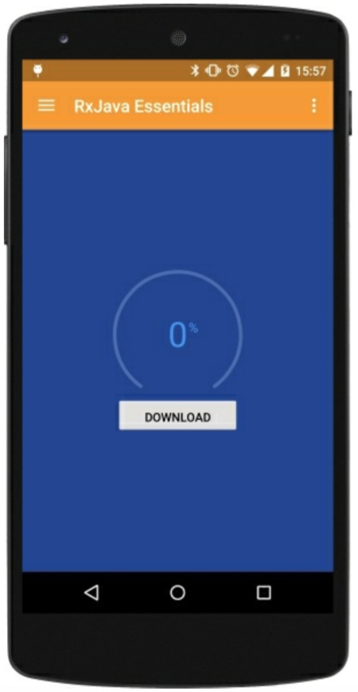

# 执行网络任务

网络在今天是99%的移动应用的一部分：我们总是连接远端服务器来检索我们App需要的信息。

作为网络访问的第一个方法，我们将创建下面这样一个场景:

* 加载一个进度条。
* 用一个按钮开始文件下载。
* 下载过程中更新进度条。
* 下载完后开始视频播放。

我们的用户界面非常简单，我们只需要一个有趣的进度条和一个下载按钮。



首先，我们创建`mDownloadProgress`

```java
private PublishSubject<Integer>mDownloadProgress = PublishSubject.create();
```
这个主题我们用来管理进度的更新，它和`download`函数协同工作。
```java
private boolean downloadFile(String source, String destination) {
    boolean result = false;
    InputStream input = null; 
    OutputStream output = null; 
    HttpURLConnection connection = null;
    try {
        URL url = new URL(source);
        connection = (HttpURLConnection) url.openConnection(); 
        connection.connect();
        if (connection.getResponseCode() != HttpURLConnection.HTTP_OK) {
            return false;
        }
        int fileLength = connection.getContentLength();
        input = connection.getInputStream();
        output = new FileOutputStream(destination);
        byte data[] = new byte[4096];
        long total = 0;
        int count;
        while ((count = input.read(data)) != -1) {
            total += count;
            if (fileLength >0) {
                int percentage = (int) (total * 100 / fileLength);
                mDownloadProgress.onNext(percentage);
            }
            output.write(data, 0, count); 
        }
        mDownloadProgress.onCompleted(); 
        result = true;
    } catch (Exception e) { 
        mDownloadProgress.onError(e);
    } finally { 
        try {
            if (output != null) { 
                output.close();
            }
            if (input != null) {
                input.close(); 
            }
        } catch (IOException e) {    
            mDownloadProgress.onError(e);
        }
        if (connection != null) {
            connection.disconnect();
            mDownloadProgress.onCompleted();
        }
    }
    return result;
}
```
上面的这段代码将会触发`NetworkOnMainThreadException`异常。我们可以创建RxJava版本的函数进入我们挚爱的响应式世界来解决这个问题：

```java
private Observable<Boolean> obserbableDownload(String source, String destination) {
    return Observable.create(subscriber -> {
        try {
            boolean result = downloadFile(source, destination); 
            if (result) {
                subscriber.onNext(true);
                subscriber.onCompleted(); 
            } else {
                subscriber.onError(new Throwable("Download failed."));
            }
        } catch (Exception e) { 
            subscriber.onError(e);
        } 
    });
}
```
现在我们需要触发下载操作，点击下载按钮:
```java
@OnClick(R.id.button_download)
void download() {
    mButton.setText(getString(R.string.downloading));
    mButton.setClickable(false);
    mDownloadProgress.distinct()
@Override
.observeOn(AndroidSchedulers.mainThread()) .subscribe(new Observer<Integer>() {
```


