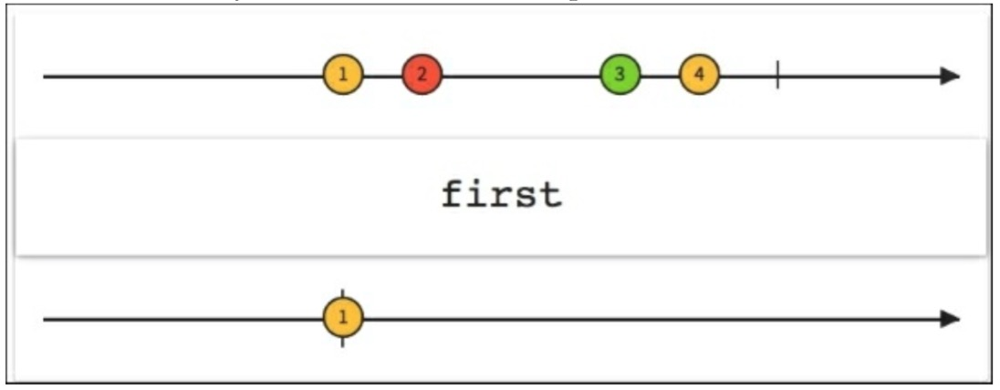

# 第一个和最后一个

下图展示了如何从一个从可观测源序列中创建只发射第一个元素的序列。

`first()`方法和`last()`方法很容易弄明白。它们从Observable中只发射第一个元素或者最后一个元素。这两个都可以传`Func1`作为参数，：一个可以确定我们感兴趣的第一个或者最后一个的谓词：

下图展示了`last()`应用在一个完成的序列上来创建一个仅仅发射最后一个元素的新的Observable。