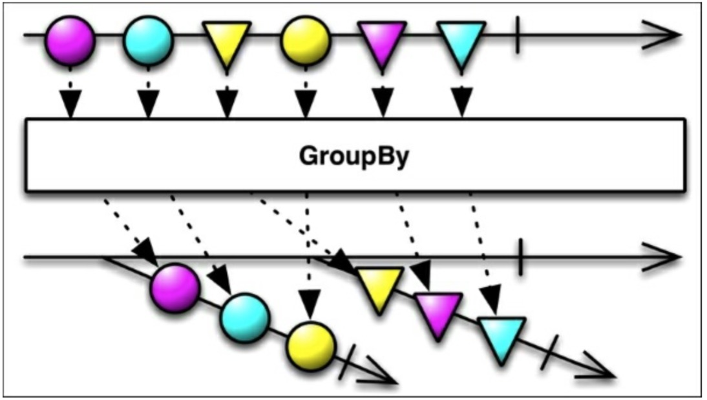

# GroupBy

拿第一个例子开始，我们安装的应用程序列表按照字母表的顺序排序。然而，如果现在我们想按照最近更新日期来排序我们的App时该怎么办？RxJava提供了一个有用的函数从列表中按照指定的规则：`groupBy()`来分组元素。下图中的例子展示了`groupBy()`如何将发射的值根据他们的形状来进行分组。



这个函数将源Observable变换成一个发射Observables的新的Observable。它们中的每一个新的Observable都发射一组指定的数据。

为了创建一个分组了的已安装应用列表，我们在我们的`loadList()`函数中引入了一个新的元素：
```java
Observable<GroupedObservable<String,AppInfo>> groupedItems = Observable.from(apps)
    .groupBy(new Func1<AppInfo,String>(){
        @Override
        public String call(AppInfo appInfo){
            SimpleDateFormat formatter = new SimpleDateFormat("MM/yyyy");
            return formatter.format(new Date(appInfo.getLastUpdateTime()));
        }
    });
```