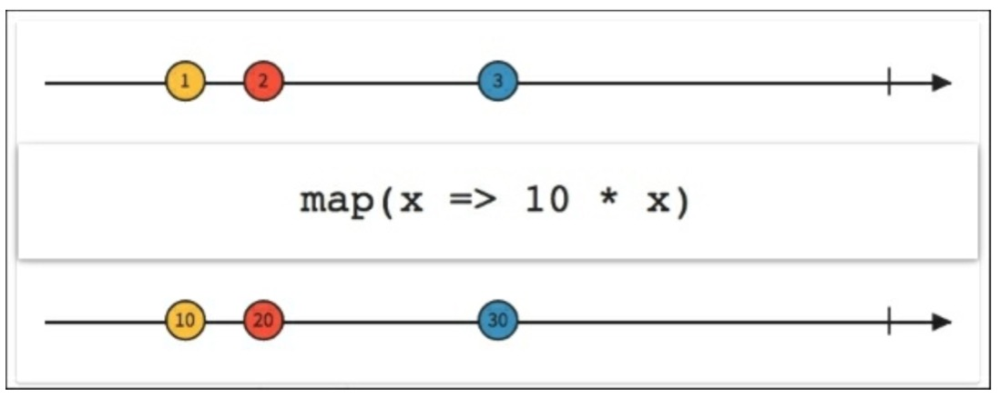
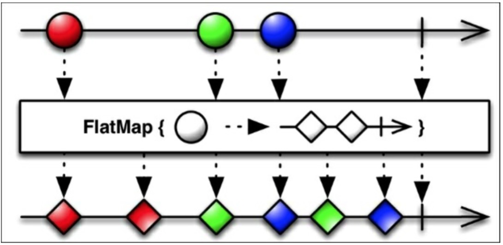

# *map家族

RxJava提供了几个mapping函数：`map()`,`flatMap()`,`concatMap()`,`flatMapIterable()`以及`switchMap()`.所有这些函数都应用一个可观测序列，变换它发射的值，用一种新的形式返回他们。让我们用合适的真实世界的例子一个个的看下它们。

## Map

RxJava的`map`函数接收一个指定的`Func`对象然后将它应用到每一个由Observable发射的值上。下图展示了如何将一个乘法函数应用到每个发出的值上以此创建一个新的Observable来发射转换的数据。



考虑我们已安装的应用列表。我们怎么才能够显示同样的列表，但是所有的名字都是小写。

我们的`loadList()`函数可以改成这样：
```java
private void loadList(List<AppInfo> apps) {
    mRecyclerView.setVisibility(View.VISIBLE);
    Observable.from(apps)
        .map(new Func1<AppInfo,AppInfo>(){
            @Override
            public Appinfo call(AppInfo appInfo){
                String currentName = appInfo.getName();
                String lowerCaseName = currentName.toLowerCase();
                appInfo.setName(lowerCaseName);
                return appInfo;
            }
        })
        .subscribe(new Observable<AppInfo>() {

            @Override
            public void onCompleted() {
                mSwipeRefreshLayout.setRefreshing(false);
            }

            @Override
            public void onError(Throwable e) {
                Toast.makeText(getActivity(), "Something went wrong!", Toast.LENGTH_SHORT).show();
                mSwipeRefreshLayout.setRefreshing(false);
            }

            @Override
            public void onNext(AppInfo appInfo) {
                mAddedApps.add(appInfo); 
                mAdapter.addApplication(mAddedApps.size() - 1,appInfo);
            }
        });
}
```

正如你看到的这样，像通常一样创建我们发射的Observable，我们加一个`map`调用，我们可以创建一个简单的函数来更新`AppInfo`对象并提供一个小写的新版本的名字给观察者。

## FlatMap

在复杂的场景中，我们有一个这样的Observable：它发射一个数据序列，这些数据本身也可以发射Observable。RxJava的`flatMap()`函数提供一种铺平序列的方式，然后合并这些Observables发射的数据，最后将合并后的结果作为最终的Observable。




