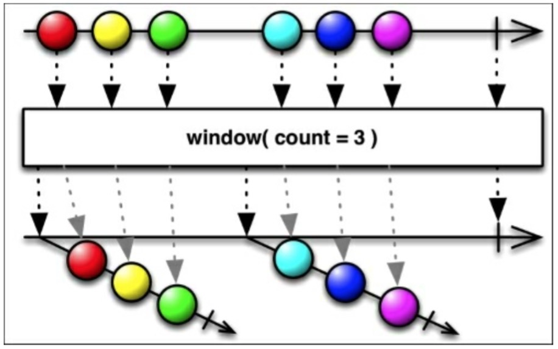

# Window

RxJava的`window()`函数和`buffer()`很像，但是它发射的时Observable而不是列表。下图展示了`window()`如何缓存3个数据项并把它们作为一个新的Observable发射出去。

这些Observables中的每一个都发射原始Observable数据的一个子集，数量由`count`指定,最后发射一个`onCompleted()`结束。正如`buffer()`,`window()`有一个`skip`变体,如下图所示：

